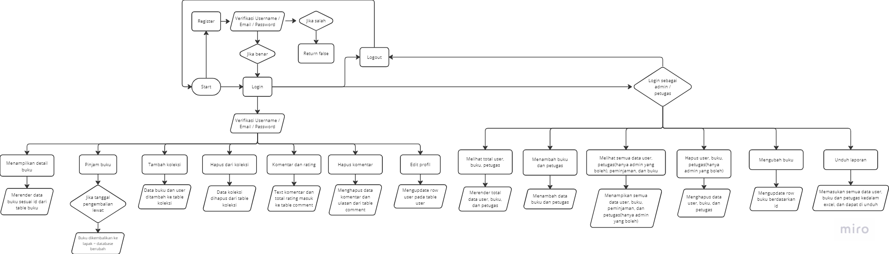

### Dokumentasi Program UKK RPL 2024 | Bacayuk – Joan Purba 12 RPL 1

**Pendahuluan** 

Bacayuk, merupakan platform perpustakaan berbasis online, dan offline. Di sisi online, platform ini dapat memberitahu, menginfokan, dan menyediakan buku yang tersedia di lapak buku. Di sisi offline, platform ini dapat mengverifikasi pemakai online sebelumnya, untuk meminjam buku, dan dikembalikan pada waktu yang sudah ditentukan 

**Design**

https://www.figma.com/file/qP7903cZGiPzBZyqR4SXQU/bacayuk?type=design&node-id=0%3A1&mode=design&t=CSAu49NNlYBmsLVW-1

**Teknologi yang dipakai** 

Designing UI/UX = Figma <br/>
Front-end = React JS Vite, Tailwind CSS, Flowbite <br/>
Back-end = Express JS, Sequelize, MySql, JWT Token <br/>
Runtime = Node JS <br/>

**Diagram alur kerja sistem(flowchart)**



**Struktur folder** 


**Database (/backend)** 


**Model (/backend)** 


**Controller (/backend)** 


**View (/frontend)** 


**Cara menjalankan**

**Clone**

```
$ git clone https://github.com/joanpoerba/bacayuk.git
```

**Run front-end**

```
cd frontend
```

```
npm run dev
```

**Run back-end**

```
cd backend
```

```
npm run dev
```
